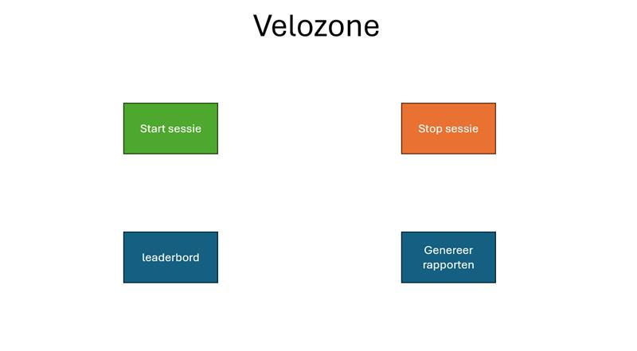

# ToDo

## Hoofdpagina

bestaat uit verschillende knoppen die elk hun eigen acties oproppen als ze ingedrukt zijn v

### Start
Aanmaken van lege dataframes voor het opslaan van de data. Transponders koppelen aan namen (optioneel)

### Leaderboard
Streamen van het live-leaderboard op het scherm. 

### Stop Sessie
Stoppen van alle dataverzameling en het sluiten van het leaderboard

### Genereer rapporten
Maak rapporten op basis van de data die er verzameld is tijdens de sessie

## Backend
### Realtime verwerkende code:
- Enkel gegevens gebaseerd op de laatst binnengekomen transponders moeten aangepast worden, dus in <u>iedere functie</u> kan er geoptimaliseerd worden.

### Vercel Functionality
Gebruik de Vercel-test repository om tests uit te voeren
We gaan vanuit JS om de vijf seconden een refresh callen om de data te updaten.